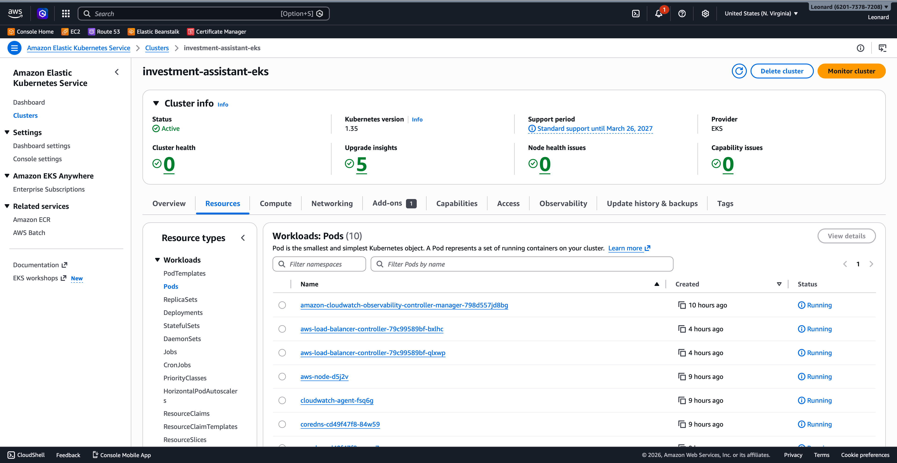

# AI Investment Research Assistant
 
An end-to-end platform that automates the collection, storage, and AI-powered analysis of stock market data for internal research teams. The system runs an intraday data pipeline via Airflow, exposes structured data and LLM-generated analysis through a FastAPI backend, and presents everything through a React dashboard, all containerized with Docker, orchestrated on Kubernetes, provisioned via Terraform on AWS, and deployed through a GitHub Actions CI/CD pipeline.
 


### 1. Automated Data Pipelines and Workflow Orchestration (Airflow)
 
**File:** `airflow/dags/stock_etl.py`
 
The Airflow DAG (`intraday_stock_etl`) runs every 3 hours during US market hours on a cron schedule of `30 9,12,15,18 * * 1-5`, that's 9:30 AM, 12:30 PM, 3:30 PM, and 6:30 PM ET, weekdays only. The 6:30 run captures final closing prices after market close.
 
For each ticker in the watchlist (`AAPL`, `MSFT`, `GOOGL`, `AMZN`, `NVDA`), the DAG executes three stages:
 
- **Fetch:** Pulls daily price data from Alpha Vantage's free API and writes structured JSON to S3 (or local filesystem in dev mode). Each record contains open, high, low, close, and volume fields.
- **Validate:** Runs quality checks, verifies the data exists, is non-empty, and that the most recent data point is no more than 5 days old. Failed validation raises an alert.
- **Notify:** After all tickers are fetched and validated, a final task POSTs to the FastAPI webhook at `/pipeline/complete`. This broadcasts a Server-Sent Event to all connected dashboards so they auto-refresh without manual intervention. The notify task uses `trigger_rule="all_done"` so it fires even if individual tickers failed.
 
The DAG uses `depends_on_past=False` and `catchup=False` to keep things simple, each run is independent. Retries are set to 2 with a 5-minute delay.
 
### 2. Containerization and Deployment (Docker + Kubernetes on AWS)
 
**Files:** `Dockerfile`, `docker-compose.yml`, `k8s/`
 
**Docker:** The production Dockerfile is a three-stage build. Stage 1 installs Node.js dependencies and builds the React dashboard with Vite into static assets. Stage 2 installs Python dependencies. Stage 3 assembles the final slim image, copies in the Python packages, application code, and built dashboard static files. The result is a single container that serves both the API and the frontend. The image runs as a non-root user and includes a healthcheck against `/health`.
 
For local development, `docker-compose.yml` starts the FastAPI server, Airflow webserver, and Airflow scheduler together, with shared volumes so the DAGs can import the app's service layer directly.
 
**Kubernetes:** Manifests use Kustomize (built into `kubectl`) with a base/overlay structure:
 
- `k8s/base/` contains valid, standalone YAML, no template variables. Includes a Deployment (2 replicas), Service (ClusterIP), ConfigMap, ServiceAccount, and a Namespace.
- `k8s/overlays/dev/` patches for local development: 1 replica, debug logging, local image tag.
- `k8s/overlays/prod/` patches for AWS: ECR image reference, IRSA annotation on the service account, and an ALB Ingress (internet-facing) for external access.
 
Secrets are managed separately via `kubectl create secret` or CI injection, the template in `k8s/base/secrets.template.yaml` documents the required keys but never contains real values.
 
The Deployment includes resource requests/limits (256Mi–512Mi memory, 250m–500m CPU), liveness probes hitting `/health` every 30 seconds, and readiness probes every 10 seconds.
 
### 3. RESTful Backend APIs (FastAPI)
 
**Files:** `app/main.py`, `app/routers/prices.py`, `app/routers/analysis.py`, `app/models/schemas.py`
 
The FastAPI server provides the following endpoints:
 
| Method | Path | Purpose |
|--------|------|---------|
| GET | `/health` | Health check, returns environment and LLM provider |
| GET | `/prices/{ticker}` | Returns stored price data; auto-fetches from Alpha Vantage on cache miss |
| POST | `/prices/{ticker}/refresh` | Force-fetches fresh data, bypassing the cache |
| POST | `/analyze` | Sends price data to the configured LLM and returns a plain-English analysis |
| GET | `/watchlist` | Returns the list of tracked tickers |
| GET | `/pipeline/status` | Derives pipeline health from data freshness per ticker |
| POST | `/pipeline/complete` | Webhook for Airflow, broadcasts SSE event to dashboards |
| GET | `/events/pipeline` | Server-Sent Events stream for real-time dashboard notifications |
| GET | `/docs` | Auto-generated Swagger UI (from OpenAPI spec) |
| GET | `/` | Serves the React dashboard (when built static files are present) |
 
All request and response payloads are typed with Pydantic models in `app/models/schemas.py`. This gives automatic validation, serialization, and self-documenting API schemas. The OpenAPI spec at `/docs` serves as a live contract between the backend and any consuming team.
 
Configuration is centralized in `app/config.py` using `pydantic-settings`, which loads from environment variables with `.env` file fallback.
 
In production, the FastAPI server also serves the React dashboard as static files, Vite builds the dashboard into `static/`, and FastAPI mounts it with a SPA catch-all so client-side routing works on page refresh.
 
### 4. LLM API Integration (OpenAI)
 
**File:** `app/services/llm_service.py`
 
The LLM service abstracts provider differences behind a single `analyze(ticker, prices, question)` function that returns `(analysis_text, provider_name)`. The active provider is set via the `LLM_PROVIDER` environment variable (`"openai"` or `"anthropic"`).
 
Both providers receive the same structured prompt: a system message defining the analyst persona, followed by a user message containing the ticker, a formatted price data table, and the research question. The price table is capped at the most recent 30 data points to keep token usage predictable and costs controlled.
 
Provider-specific details:
 
- **OpenAI:** Uses `gpt-4o-mini` via `AsyncOpenAI` with `max_tokens=512` and `temperature=0.3` for consistent, focused output.
- **Anthropic:** Uses `claude-sonnet-4-20250514` via `AsyncAnthropic` with the same token limit. The system prompt is passed via the dedicated `system` parameter.
 
Both clients are async, so LLM calls don't block the FastAPI event loop. Errors from either provider bubble up as HTTP 502 responses with the error detail included.
 
### 5. CI/CD Pipelines and Infrastructure-as-Code
 
**Files:** `.github/workflows/ci.yml`, `terraform/`
 
**CI/CD (GitHub Actions):** The pipeline has four stages:
 
1. **Test** (every push/PR): Installs dependencies, runs `ruff` for linting, and executes the full `pytest` suite with mocked external dependencies.
2. **Build** (main branch only): Authenticates to ECR via OIDC role assumption, builds the multi-stage Docker image, tags it with the commit SHA, and pushes to ECR.
3. **Deploy** (main branch only): Configures `kubectl` for the EKS cluster, uses `kustomize edit set image` to inject the exact commit SHA tag into the prod overlay, applies with `kubectl apply -k --server-side`, and waits for the rollout to complete.
4. **Terraform Plan** (PRs only): Runs `terraform plan` and posts the diff as a comment on the pull request so infrastructure changes are reviewed before merge.
 
The deploy step includes a `kubectl auth can-i` verification step that fails fast with a clear error if cluster access is broken, rather than producing a confusing OpenAPI validation error.
 
**Infrastructure-as-Code (Terraform):** All AWS resources are defined in `terraform/main.tf`:
 
- **VPC:** 2 AZs, public and private subnets, single NAT gateway (cost-optimized for demo).
- **EKS:** Managed node group (`t3.medium`), private + public API endpoints, IRSA enabled, EKS access entries for the CI deploy role.
- **S3:** Versioned, encrypted (AES-256), all public access blocked.
- **ECR:** Image scanning on push, lifecycle policy keeping the last 10 images.
- **IAM:** IRSA role for the API pods with least-privilege S3 access (GetObject, PutObject, ListBucket only on the data bucket).
 
The Terraform state can be stored in S3 with DynamoDB locking (commented out in `provider.tf`, ready to uncomment for team use).
 
### 6. Cross-Functional Collaboration
 
This shows up throughout the project in design decisions rather than a single file:
 
- **Typed Pydantic schemas** (`app/models/schemas.py`) serve as a contract between backend and consuming teams. When a researcher asks "what fields does the analysis response contain?", the schema is the source of truth, and it's enforced at runtime.
- **Auto-generated OpenAPI docs** at `/docs` give research teams interactive API documentation they can explore without reading code. They can test endpoints directly from the browser.
- **React dashboard** (`dashboard/src/Dashboard.jsx`) translates raw API data into something a non-engineer can use, price charts, AI analysis summaries, a chat interface for ad-hoc questions, and pipeline health monitoring.
- **Configurable watchlist** in the Airflow DAG (`TICKERS` list) is a simple list that analysts can extend by name, no pipeline code changes needed.
- **Test suite** (`tests/test_api.py`) with mocked external dependencies ensures changes don't break existing behavior. Tests cover the full request-response cycle for every endpoint, including error cases.
 
---


## Screenshot


## Project Structure
 
```
ai-investment-assistant/
├── airflow/
│   └── dags/
│       └── stock_etl.py            # Intraday ETL: fetch → validate → notify
├── app/
│   ├── main.py                     # FastAPI entrypoint, SSE stream, static serving
│   ├── config.py                   # Centralized settings (pydantic-settings)
│   ├── routers/
│   │   ├── prices.py               # GET /prices, POST /prices/refresh
│   │   └── analysis.py             # POST /analyze (LLM-powered)
│   ├── services/
│   │   ├── llm_service.py          # OpenAI + Anthropic abstraction
│   │   ├── stock_fetcher.py        # Alpha Vantage client
│   │   └── storage.py              # S3 / local filesystem persistence
│   └── models/
│       └── schemas.py              # Pydantic request/response models
├── dashboard/
│   ├── src/
│   │   ├── Dashboard.jsx           # Main React component
│   │   └── main.jsx                # Vite entry point
│   ├── vite.config.js              # Dev server with API proxy
│   ├── index.html
│   └── package.json
├── k8s/
│   ├── base/                       # Shared Kustomize manifests
│   │   ├── kustomization.yaml
│   │   ├── namespace.yaml
│   │   ├── serviceaccount.yaml
│   │   ├── configmap.yaml
│   │   ├── deployment.yaml
│   │   ├── service.yaml
│   │   └── secrets.template.yaml
│   ├── overlays/
│   │   ├── dev/                    # 1 replica, debug logging
│   │   └── prod/                   # ECR image, IRSA, ALB ingress
│   └── README.md
├── terraform/
│   ├── main.tf                     # VPC, EKS, S3, ECR, IAM
│   ├── variables.tf
│   ├── outputs.tf
│   ├── provider.tf
│   └── README.md
├── tests/
│   ├── test_api.py                 # Endpoint + service tests
│   └── conftest.py
├── .github/
│   └── workflows/
│       └── ci.yml                  # Lint → Test → Build → Deploy + TF Plan
├── Dockerfile                      # 3-stage: React build + Python deps + runtime
├── docker-compose.yml              # Local dev: API + Airflow
├── requirements.txt
├── .env.example
└── .gitignore
```
 